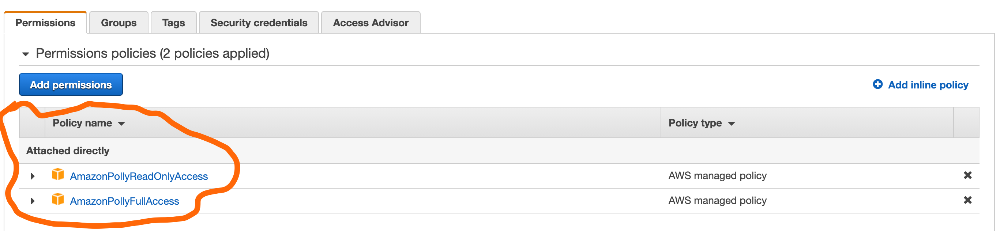

# ari

**A**utomated

**R**

**I**nstructor

[Ari is an R package](https://github.com/jhudsl/ari) that helps you create slides with automatic audio captions. It is developed at [Johns Hopkins Data Science Lab](https://github.com/jhudsl), and created by [Sean Kross](http://seankross.com/).

Here is an example of the kind of video you can make, by [Sean Kross](http://seankross.com/):

<iframe width="560" height="315" src="https://www.youtube.com/embed/dcIUu4GCOKU" frameborder="0" allow="accelerometer; autoplay; clipboard-write; encrypted-media; gyroscope; picture-in-picture" allowfullscreen></iframe>

## Getting setup with ari

This is a guide based on [the ari README](https://github.com/jhudsl/ari).

In order to create an ari video, you need to:

1. Provide an HTML slide deck such as [`ioslides`](https://bookdown.org/yihui/rmarkdown/ioslides-presentation.html) or [`xaringan`](https://bookdown.org/yihui/rmarkdown/xaringan.html)
1. Provide some set of subtitles/script for each slide 
  - Either in a separate file, or in each slide
1. Set up an account with Amazon Web Services for AWS Polly (free, as I understand it)
  - see [this guide by Sean Kross](http://seankross.com/2017/05/02/Access-Amazon-Web-Services-in-R.html), but ensure to select Polly related webservices instead of S3 bucket ones as provided in the post.
1. Share your API key with polly (and be sure to NEVER EVER commit this to github)
1. Have [ffmpeg](ffmpeg.org) installed


### Provide an HTML slide deck

You need some kind of HTML slide deck. 

One of the easiest ways to create them is to use Rstudio's guided process:

File > New File > R Markdown > from Template > pick a Xaringan slide deck

Or

File > New File > R Markdown > Presentation > choose ioslides.

For more information see the [chapter on slide decks in R](https://github.com/numbats/resources/blob/master/slides.Rmd).

### Provide some set of subtitles/script for each slide 

Either in a separate file, or in each slide as an HTML comment.

If you are going the separate file route:

- A markdown file with each slide separated by a second level header (`##`) and then your script text. See `file.show(ari_example("ari_intro_script.md"))` for an example.
- An HTML file of slides `browseURL(ari_example("ari_intro.html"))`

If you are going the slides as HTML comment route:

- Have an Rmarkdown file with HTML comments (`<!-- this is an HTML comment -->`) that denote the script. See `file.show(ari_example("ari_comments.Rmd"))` for an example.

### Set up an account with Amazon Web Services for AWS Polly 

This is free, as far as I understand it. To get setup, follow [this guide by Sean Kross](http://seankross.com/2017/05/02/Access-Amazon-Web-Services-in-R.html). But ensure to select Polly related webservices instead of S3 bucket ones as provided in the post.

```{r aws-polly}

```

### Share your API key with polly 

To share use polly from within R, you need to set some environment variables.

What even are "Environment Variables"? They are named values that tell some external application some information. In this case, we are telling AWS our KEY ID and ACCESS KEY, and it uses that information to verify who we are. You can think of it like a username and password. They often look something like this:

```
AWS_ACCESS_KEY_ID=HFepbTd3gnHeL5w3IJFZ
SOME_OTHER_API_KEY=VpewOKpQ5Y4ir48R78n2
YET_ANOTHER_API=olAs4e1OX5qP2cD4Kp4U
```

This key here refers to an AWS Access Key ID.

This sort of format might sometimes referred to as `key-value` pairs, the thing on the left is the key, and the thing on the right is that key's value. E.g., `name: Nick` - the key is "name", and it's value is "Nick").

You can read more on Environment Variables at this [medium post](https://medium.com/chingu/an-introduction-to-environment-variables-and-how-to-use-them-f602f66d15fa) and on [wikipedia (yes, they are that important that they get their own wiki page!)](https://en.wikipedia.org/wiki/Environment_variable). You can also learn more about how R uses this (and what R does when it boots up) by looking at the helpfile for `Startup` - `?Startup`.

#### Approach one, use `Sys.setenv`

The first is to set the environment variable each time you use `ari`. To do this, you use `Sys.setenv`, like so  each time you use `ari`:


```r
# First set up your AWS keys
# (note this is fake API data)
Sys.setenv("AWS_ACCESS_KEY_ID" = "EA6TDV7ASDE9TL2WI6RJ",
           "AWS_SECRET_ACCESS_KEY" = "OSnwITbMzcAwvHfYDEmk10khb3g82j04Wj8Va4AA",
           "AWS_DEFAULT_REGION" = "us-east-2")
           
# Create a video from a Markdown file and slides
ari_narrate(
  ari_example("ari_intro_script.md"),
  ari_example("ari_intro.html"),
  voice = "Joey"
  )
```

Using `Sys.setenv` will work for each R session. So, if you restart R, you will need to run the `Sys.setenv` code each time. I prefer to avoid that, since it means I need to record that information somewhere on my computer, which creates extra work each time. To avoid that, I use `.Renviron` approach described below.

#### Approach two: use `.Renviron`

Another approach is to save these in your personal R evironment - your `.Renviron` file. This is a special file that you can store these environmental keys. The way this works is that when R starts up, it searches for a `.Renviron` file (located at `fs::path_home()`, or within the current folder) and then loads the environment variables there. 

This all felt a bit mysterious to me the first couple of times I used it - but this process is made simpler with `usethis::edit_r_environ()`

This opens up the `.Renviron` file, and tells you to restart R for changes to take effect:

```
> usethis::edit_r_environ()
● Modify '/Users/ntie0001/.Renviron'
● Restart R for changes to take effect
```

So you would edit the file and place something like the following in it:

```
AWS_ACCESS_KEY_ID=eim417O8HbM0A21g4uv8
AWS_SECRET_ACCESS_KEY=svIr03835X5tdndEw7c5CRaAOYbSj04rA2p302il
AWS_DEFAULT_REGION=ap-southeast-2
```

Then, follow the instructions from usethis, and

1. Close the opened ".Renviron" file.
2. Restart R

#### A cautionary note on sharing keys.

Remember to NEVER EVER commit files containing keys to github. If you notice that you have, you should immediately delete these keys from AWS (or wherever the keys are from), which prevents them from further use. 

This is important because if someone gets a hold of these keys, the can potentially rack up many hours of time on AWS servers, which in turn could cost you serious `$$$`. There are bots that trawl through github looking for tokens like this, so it is not so much a case of if this will happen, but **when**. 

### Have [ffmpeg](https://ffmpeg.org/) installed

`ffmpeg` is "A complete, cross-platform solution to record, convert and stream audio and video."

You can download it [here](https://ffmpeg.org/download.html).

You can check if `ffmpeg` is installed with

```{r ari-ffmpeg-version}
ari::ffmpeg_version()
```

### Narrate the video

You can create a video with `ari_narrate()`.

For the following directory structure:

```
ari/
   - ari-example.Rmd
   - ari-example.html
```

You would call the following:

```r
ari_narrate(script = "ari/ari-example.Rmd",
            slides = "ari/ari-example.html",
            output = "ari/ari-video-nicole.mp4",
            voice = "Nicole",
            # voice = "Russell",
            subtitles = TRUE,
            # this needs to be "iterative" or it won't advance the slides
            # also each slide needs to have a script or the video will be out
            # of sync. Including the title slide!
            capture_method = "iterative")
```

This would then create:

```
ari/
   - ari-example.Rmd
   - ari-example.html
   - ari-video-nicole.mp4
   - ari-video-nicole.srt
```

You can see an example of the ari slides in "ari-example.Rmd"  and "ari-run.R" https://github.com/numbats/resources/tree/master/ari of this GitHub directory.

## Helper function for `ari`

Below is a helper function for `ari` if you just want to provide a single Rmarkdown file and not specify the HTML as well:


```{r}
ari_narrate_auto <- function(slides, render = TRUE, voice = "Nicole"){
  
  if (render) {
    rmarkdown::render(input = slides)
  }
  
  ari_narrate(script = slides,
              slides = xfun::with_ext(slides, "html"),
              output =xfun::with_ext(slides, "mp4"),
              voice = voice,
              subtitles = TRUE,
              # this needs to be "iterative" or it won't advance the slides
              # also each slide needs to have a script or the video will be out
              # of sync. Including the title slide!
              capture_method = "iterative")
}
```


Example usage - point it at an Rmd file:

```{r ari-example-auto, eval = FALSE}
ari_narrate_auto("ari/ari-example.Rmd") 

```

## Troubleshooting `ari`.

Slide stuck on first one
 - Ensure `capture_method = "iterative"`
 
Slides skip / don't align with script
  - Ensure all slides have a script file, and only one script file

Warning message like:

```
Warning messages:
1: In pollyHTTP(action = "voices", verb = "GET", query = query, ...) :
  Forbidden (HTTP 403).
2: In structure(out[["Voices"]], NextToken = out[["NextToken"]]) :
  Calling 'structure(NULL, *)' is deprecated, as NULL cannot have attributes.
  Consider 'structure(list(), *)' instead.
```

 - Check that your AWS keys are still valid