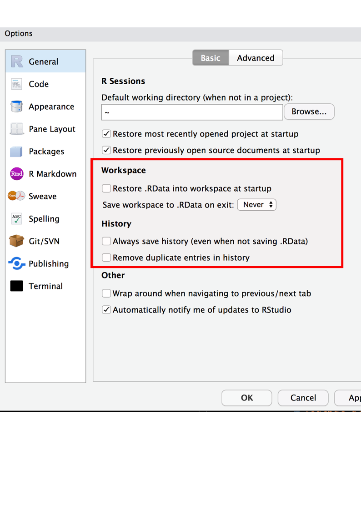

# Installing R

To get started with R, you need to download and install R, and RStudio. The two guides below provide some good stepwise on getting started with installing R and RStudio.

- [installr guide by Stuart Lee](https://github.com/sa-lee/installr)
- [STAT 545's guide](https://stat545.com/install.html)

There is also a [nice cheatsheet on using Rstudio](https://github.com/rstudio/cheatsheets/raw/master/rstudio-ide.pdf)

There are some default options for Rstudio that I recommend setting, which help you improve your reproducibility, and security.(taken from [this guide](https://rmd4sci.njtierney.com/rstudio-what-and-why.html#exercise-rstudio-default-options)).

Tools > Global Options (or `Cmd + ,` on macOS)

Under the **General** tab:

- For **workspace**
    - Uncheck restore .RData into workspace at startup
    - Save workspace to .RData on exit : "Never"
- For **History**
    - Uncheck "Always save history (even when not saving .RData)
    - Uncheck "Remove duplicate entries in history"

```{r fig-rstudio-workspace-options, fig.cap = "Setting the options right for RStudio, so you don't restore previous sessions work, and don't save it either.", out.width = "50%", echo = FALSE}

```

This means that you won't save the objects and other things that you create in your R session and reload them. This is important for two reasons:

1. **Reproducibility**: you don't want to have objects from last week cluttering your session
2. **Privacy**: you don't want to save private data or other things to your session. You only want to read these in.

Your "history" is the commands that you have entered into R. Not saving your history means that you won't be relying on things that you typed in the last session, which is a good habit to get into! Also it saves R loading up every. single. object. You've created - which can add up to a lot over a few months. A colleague of mine once had issues with an RStudio project where it would take many minutes to load up, because it had stored all their data for 6 months worth of statistical analysis. This ended up being more RAM than they had. So, you can even save yourself some speed as well!

## Using RStudio projects

I recommend setting up an RStudio project for your work. This helps encapsulate your projects. To learn more about this, see [this chapter of Rmarkdown for Scientists](https://rmd4sci.njtierney.com/workflow.html).